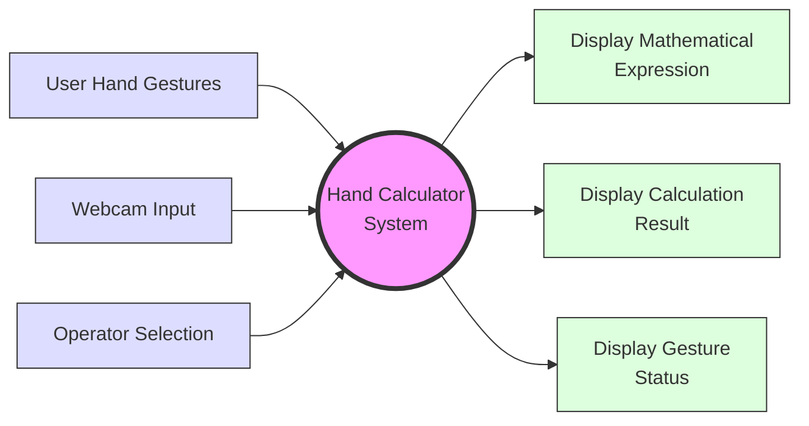

# Level 0 Data Flow Diagram - Hand Calculator

## Components Description

### External Entities
- **User**: Provides hand gestures for number input and operations
- **Webcam**: Captures continuous video feed for gesture recognition
- **Operator Selection**: User's gestures for selecting mathematical operations

### Core Process
- **Hand Calculator System**: Central process that handles gesture recognition, calculation, and display management

### Output Processes
- **Mathematical Expression Display**: Shows current input and operations
- **Calculation Result**: Displays the computed results
- **Gesture Status**: Provides real-time feedback on gesture recognition

## Data Flows
### Input Flows
- Hand gestures for numbers (0-9)
- Real-time video feed from webcam
- Operator selection gestures (+, -, *, /, =, C)

### Output Flows
- Current mathematical expression
- Calculation results
- Gesture recognition status
- Visual feedback in ROI boxes 